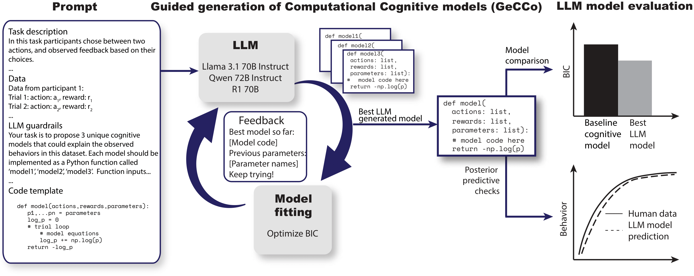

[](https://arxiv.org/abs/2502.00879)

# 🧠 GeCCo: Guided Generation of Computational Cognitive Models

Authors: [Milena Rmus](https://github.com/MilenaCCNlab) and [Akshay K. Jagadish](https://akjagadish.github.io/)

## 📘 Overview

Guided Generation of Computational Cognitive Models (GeCCo) is a pipeline for automated generation of computational cognitive models using large language models (LLMs).

Given task instructions, participant data from cognitive tasks, and a template function, GeCCo:

1. Prompts an LLM to generate candidate cognitive models as executable Python functions
2. Fits these models offline to held-out participant data using maximum likelihood estimation
3. Uses measures using AIC/BIC to evaluate the model quality and uses that to guide further model generation
4. Refines the generated models over multiple iterations based on structured feedback



## 🧩 Key Features

- 🧮 Task-agnostic design through configurable input columns
- ⚙️ YAML configuration for tasks, data, LLM settings, and evaluation
- 🧱 Modular architecture (prompting, fitting, evaluation, feedback)
- 🤖 LLM-driven model generation as interpretable Python functions
- 📊 Automated fitting with multi-start L-BFGS-B optimization
- 📈 BIC/AIC tracking with persisted best models and iteration results
- 🔁 Iterative search loop with optional manual or LLM-generated feedback

## 📂 Repository Structure

```text
.
├── README.md
├── requirements.txt
├── config/
│   ├── decision_making.yaml
│   ├── schema.py
│   └── two_step.yaml
├── data/
│   ├── multi_attribute_decision_making.csv
│   ├── rlwm.csv
│   ├── standardize_data.py
│   └── two_step_data.csv
├── gecco/
│   ├── __init__.py
│   ├── run_gecco.py
│   ├── utils.py
│   ├── construct_feedback/
│   │   ├── __init__.py
│   │   └── feedback.py
│   ├── load_llms/
│   │   ├── __init__.py
│   │   ├── gpt_backend.py
│   │   ├── llama_backend.py
│   │   ├── model_loader.py
│   │   ├── qwen_backend.py
│   │   └── r1_backend.py
│   ├── offline_evaluation/
│   │   ├── __init__.py
│   │   ├── data_structures.py
│   │   ├── evaluation_functions.py
│   │   ├── fit_generated_models.py
│   │   └── utils.py
│   ├── prepare_data/
│   │   ├── __init__.py
│   │   ├── data2text.py
│   │   └── io.py
│   └── prompt_builder/
│       ├── __init__.py
│       ├── guardrails.py
│       └── prompt.py
├── results/
│   ├── multi_attribute_decision_making/
│   │   ├── bics/
│   │   └── models/
│   └── two_step_task/
│       ├── bics/
│       └── models/
└── scripts/
    ├── decision_making_demo.py
    └── two_step_demo.py
```

## 🚀 Installation

### Prerequisites

- Python ≥ 3.10
- pip or conda

### Install dependencies

```bash
git clone https://github.com/MilenaCCNlab/gecco.git
cd gecco
pip install -r requirements.txt
```

## 🧰 Requirements

See `requirements.txt` for full list. Core packages include:

- numpy, pandas, scipy
- torch, transformers
- pyyaml, pydantic
- openai (for OpenAI backend)

Optional (for local LLMs): vllm, accelerate

### API keys (if using OpenAI)

```bash
export OPENAI_API_KEY=your_openai_api_key_here
```

## ⚙️ Configuration

All experiment parameters are specified in YAML files under `config/`.

Key sections include:

- `task`: task description and modeling goal for the LLM
- `data`: dataset path/columns and narrative template used for prompting
- `llm`: provider/model and output constraints/guardrails
- `evaluation`: metric and optimizer options
- `feedback`: feedback mode between iterations
- `loop`: number of iterations and runs

Example (`config/two_step.yaml`):

```yaml
task:
  name: "two_step_task"
  description: "Participants choose between spaceships and interact with aliens for rewards."
  goal: "Propose {models_per_iteration} cognitive models as Python functions: {model_names}"

data:
  path: "data/two_step_data.csv"
  id_column: "participant"
  input_columns: ["choice_1", "state", "choice_2", "reward"]
  data2text_function: "narrative"
  narrative_template: |
    The participant chose spaceship {choice_1}, traveled to planet {state},
    asked alien {choice_2}, and received {reward} coins.
  splits:
    prompt: "first3"
    eval: "next10"
    test: "remainder"

llm:
  provider: "openai"
  base_model: "gpt-4"
  temperature: 0.2
  max_output_tokens: 2048
  models_per_iteration: 3
  include_feedback: true
  guardrails:
    - "Each model must be a standalone Python function"
    - "Function names: cognitive_model1, cognitive_model2, ..."
    - "Return negative log-likelihood of observed choices"
    - "Include clear docstrings with parameter bounds"

evaluation:
  metric: "bic"           # or "aic"
  optimizer: "L-BFGS-B"
  n_starts: 10

feedback:
  type: "manual"          # or "llm"

loop:
  max_iterations: 5
  max_independent_runs: 1

```

## 🎯 Usage

Quick start with demo scripts:

```bash
# Two-step decision task
python scripts/two_step_demo.py

# Multi-attribute decision making
python scripts/decision_making_demo.py
```

Programmatic usage:

```python
from config.schema import load_config
from gecco.prepare_data.io import load_data, split_by_participant
from gecco.prepare_data.data2text import get_data2text_function
from gecco.load_llms.model_loader import load_llm
from gecco.run_gecco import GeCCoModelSearch
from gecco.prompt_builder.prompt import PromptBuilderWrapper

# load config
cfg = load_config("config/two_step.yaml")

# load and prepare data
df = load_data(cfg.data.path, cfg.data.input_columns)
splits = split_by_participant(df, cfg.data.id_column, cfg.data.splits)

# get prompt and eval splits
df_prompt, df_eval = splits["prompt"], splits["eval"]

# convert data to narrative text
data2text = get_data2text_function(cfg.data.data2text_function)
data_text = data2text(
    df_prompt,
    id_col=cfg.data.id_column,
    template=cfg.data.narrative_template,
    value_mappings=getattr(cfg.data, "value_mappings", None),
)

# build prompt
prompt_builder = PromptBuilderWrapper(cfg, data_text)

# load llm
model, tokenizer = load_llm(cfg.llm.provider, cfg.llm.base_model)

# setup GeCCo
search = GeCCoModelSearch(model, tokenizer, cfg, df_eval, prompt_builder)

# run search
best_model, best_bic, best_params = search.run_n_shots(run_idx=0)

# print results: best model code, BIC, params
print("Best Model Code:\n", best_model)
print("Best BIC:", best_bic)
print("Best Parameters:", best_params)
```

## 🧪 How it works

1. Build a structured prompt with task description, example data (as a narrative), guardrails, and optional feedback
2. Generate multiple candidate models per iteration as Python functions
3. Extract function code, parameter names, and bounds
4. Fit each model to each participant via multi-start L-BFGS-B
5. Compute BIC/AIC and track the best model
6. Feed back guidance for the next iteration and repeat

## 📊 Output

After runs, results are saved under `results/<task_name>/`:

```text
results/two_step_task/
├── models/
│   ├── best_model.py
│   ├── iter0.py
│   ├── iter1.py
│   └── ...
└── bics/
    ├── iter0.json
    ├── iter1.json
    └── ...
```

Each JSON contains entries like:

```json
[
  {
    "function_name": "cognitive_model1",
    "metric_name": "BIC",
    "metric_value": 245.67,
    "param_names": ["alpha", "beta", "w"],
    "code_file": "results/two_step_task/models/iter0.py"
  }
]
```

## 🤝 Contributing

Contributions are welcome! Please open an issue or pull request.

## 📄 License

[](https://opensource.org/licenses/MIT)

## 📚 Citation

If you use GeCCo in research, please cite:

```bibtex
@article{rmus2025generating,
  title={Generating Computational Cognitive Models using Large Language Models},
  author={Rmus, Milena and Jagadish, Akshay K. and Mathony, Marvin and Ludwig, Tobias and Schulz, Eric},
  journal={Advances in Neural Information Processing Systems},
  year={2025},
  url={https://arxiv.org/abs/2502.00879},
}
```

For questions or issues, please open a GitHub issue.
